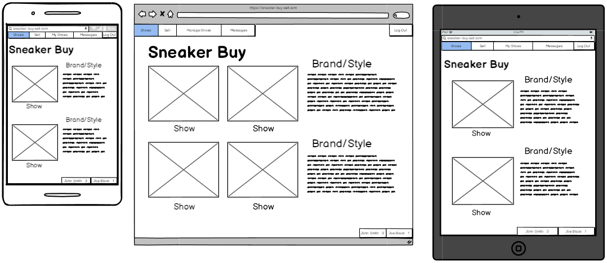
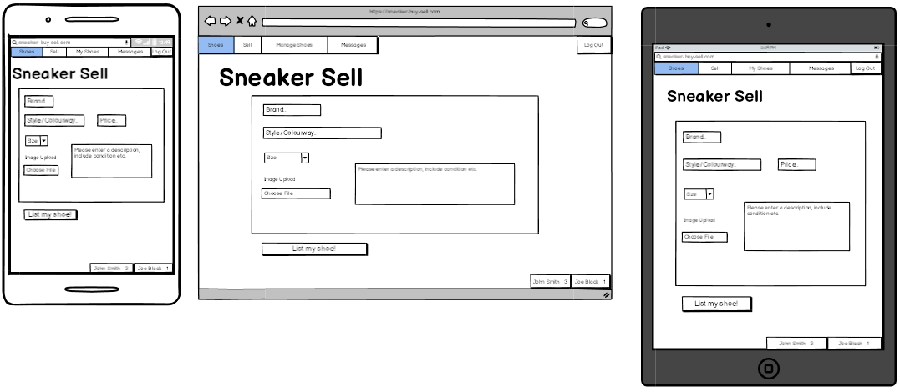
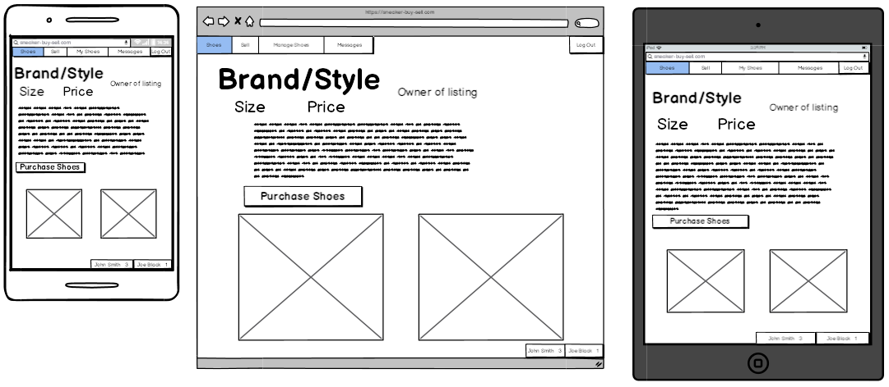
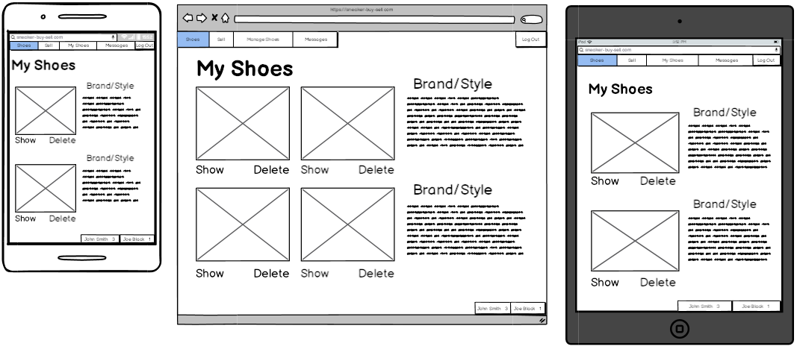
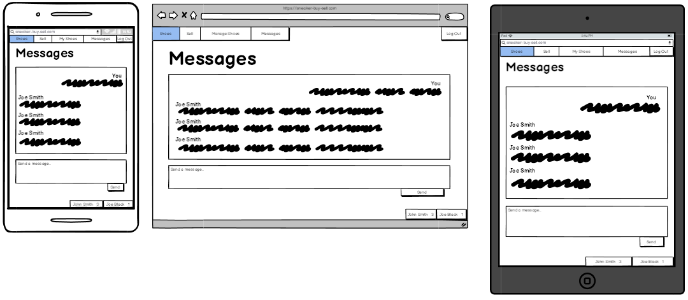
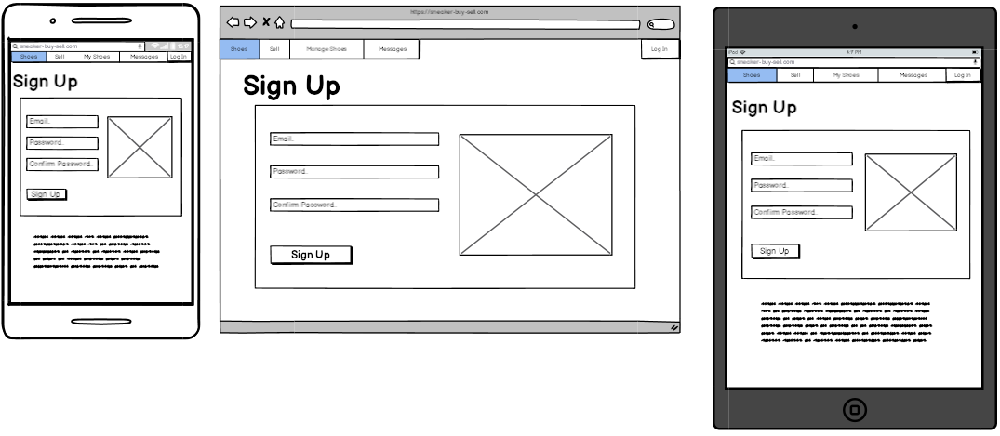
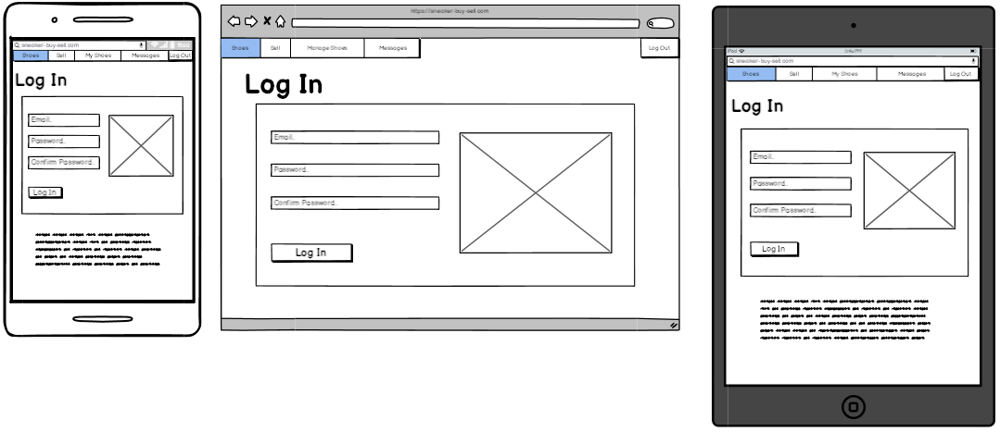
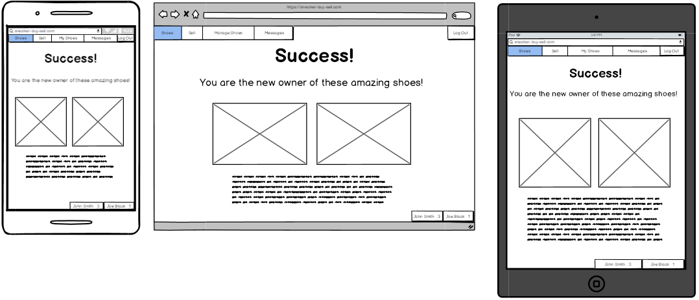
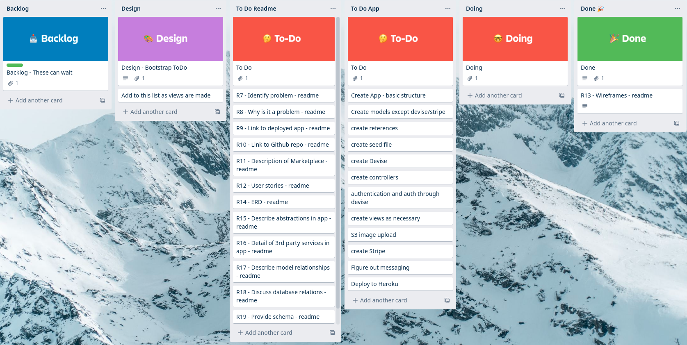

# README

## Notes

time ago in words for created at timestamps
twilio for chat
foreign keys sit on belongs_to tables. they are whatever it belongs to '_id' eg. restaurant_id
active record migrations docs/references for syntax to add foreign key
create models then do foreign keys, match ERD
Do seeds after models and associations, puts in seed file, start finish
  build out what needs to be rendered in views
  add necessary controller methods as needed  
  remember to link_to inbetween views using paths, index to show, back button from show
  strong params to whitelist form params on creation
  follow devise docs for user model etc. watch out for min password field
current_user is built in devise
devise routes as paths eg. destory_user_session_path to log out
after associations create needs to be current_user.model.create(model_params ) so user owns the model

lib/tasks/stripe.rake to do stripe test
put the JS in application view
stripe needs a controller and skip before_action
initializers/stripe.rb needs Stripe.api_key =
embed ruby for JS portion of key dig

DEVISE - FAKER - STRIPE - ULTRAHOOK

## R12 - User stories

The app does not distinguish between buyers and sellers, all profiles are set with the ability to create or purchase listings however the user stories are broken down between buyers and sellers to show different app functions.

User management:

- As a site visitor, I want to be able to create an account in order to log in and become a buyer and seller.
- As a buyer or seller, I want to be able to enter my email and password to log in.
- As a buyer or seller, I want to be able to logout out of my account at any time.
- As a buyer or seller, I want to be able to delete my account if I no longer want to be a part of the site.
- As a buyer or seller, I want to be able to add details to my profile in order to show other users more about me.
- As a buyer or seller, I want to be able to delete my account in case I change my mind.

Listings:

- As a site visitor, I want to be able to see an overview of listings without logging in.
- As a seller, I want to be able to create listings in order to sell my shoes.
- As a seller, I want to be able to upload a name, bio, price and photo of my shoe in order to sell it.
- As a buyer, I want to be able to search for shoes, in order to find ones with the experience I am looking for.
- As a buyer or seller, I want to be able to like/favourite other listings in order to view them in my profile for later.
- As a seller, I want to be able to edit and delete my listings in order to reflect correct information.
- As a seller, I want to be able to favourite my own listing in order to increase it's popularity.
- As a seller, I want to be able to view my current listings in one place in order to keep track of what I am selling.
- As a seller, I want to be able to reply to buyers messages in order to answer questions about my listings.
- As a buyer, I want to be able to message sellers about listings in order to find out more information.
- As a buyer or seller, I want to be notified when I receive a new message so I don't have to keep checking my inbox.

Purchases:

- As a buyer, I want to be able to purchase shoes from other users listings.
- As a seller, I want to be able to sell my shoe through the site in order to receive money from the buyer.
- As a buyer, I want to be able to access my purchase receipts in order to keep track of my purchases.
- As a seller, I want my purchased shoes to be removed from view so others don't try to purchase it again.
- As a buyer, I want to be able to view a list of shoes that I have purchased in order to keep track of my purchases.

Authentication & Authorisation:

- As a buyer or seller, I do not want other users to be able to access my account in order to keep my data safe.
- As a seller, I do not want other users to be able to edit or delete my listings.
- As a buyer or seller, I do not want other users to see my favourites.
- As a seller, I do not want to see options to buy my listings.

## R13 - Wireframes

### Home

### New

### Show

### Manage

### Messages

### Sign Up

### Log In

### Payment Success

## R20 - Trello

Initial Trello board on November 5th. Readme tasks are well defined but app tasks need to be further fleshed out as I approach aspects of the build.

