# README

## R7 - Identification of the problem you are trying to solve by building this particular marketplace app

A two way marketplace for sneakers does not currently exist in Australia that is widely used. There are a few international marketplaces like 'Goat' and 'StockX' that are widely used. These function heavily as a third party that takes a large cut of sales and manages the buying and selling themselves. The closest model that fits the scope of 'KICKSWAP' is 'Depop', which is not focused on shoes and again is an international company. 'KICKSWAP' aims to be the premier marketplace for buying and selling sneakers in a solely Australian focused market. 'KICKSWAP' will operate in a model similar to 'Gumtree', wherein users can be buyers or sellers. These buyers and sellers are then responsible for the management of their sales and purchases with 'KICKSWAP' merely being a platform. The removal of a sales cut also means sellers can save more and pass those savings on to the buyers.

## R8 - Why is it a problem that needs solving?

This problem needs solving because both sneaker buyers and sellers need an Australian website that understands the needs and unique ecosystem of shoes within Australia. The large sales cuts that other shoe and clothing marketplaces take from sellers is also an issue. As a majority of people buying and selling sneakers are not those who are doing it professionally, they should not have large amounts of sales profit taken from them.

## R9 - A link (URL) to your deployed app

[kickswap.herokuapp.com](https://kickswap.herokuapp.com)

## R10 - A link to your GitHub repository

[github.com/Finbob12/sneaker-buy-sell](https://github.com/Finbob12/sneaker-buy-sell)

## R11 - Description of your marketplace app

### Purpose

The purpose of Kickswap is to create an open platform for Australian sneaker enthusiasts to buy and sell sneakers with each other, without a company taking a large cut of the sales. This will fill a hole in the current market.

### Functionality/Features

**Listings:** Any user can create a listing on Kickswap for other users to view and purchase. These listings require a brand, style, price, size, picture and description. Any and all of these details can be updated by the user at any point after creating their listing. These listings may also be deleted by the user who created them at any time. If a listing is purchased by a user, the listing is then marked as sold and will no longer show up for other users to view. Buyers and sellers can then organise delivery or pick-up of the listing.

**Sitemap:**

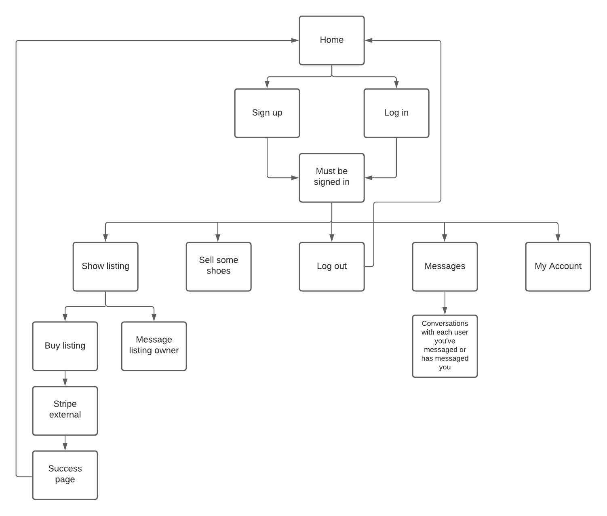

### Screenshots

**Home**
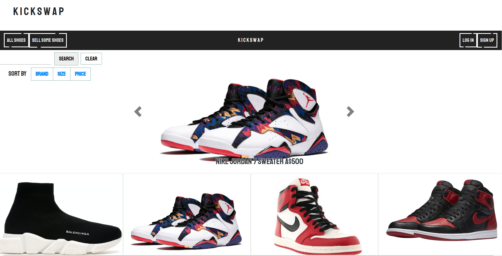
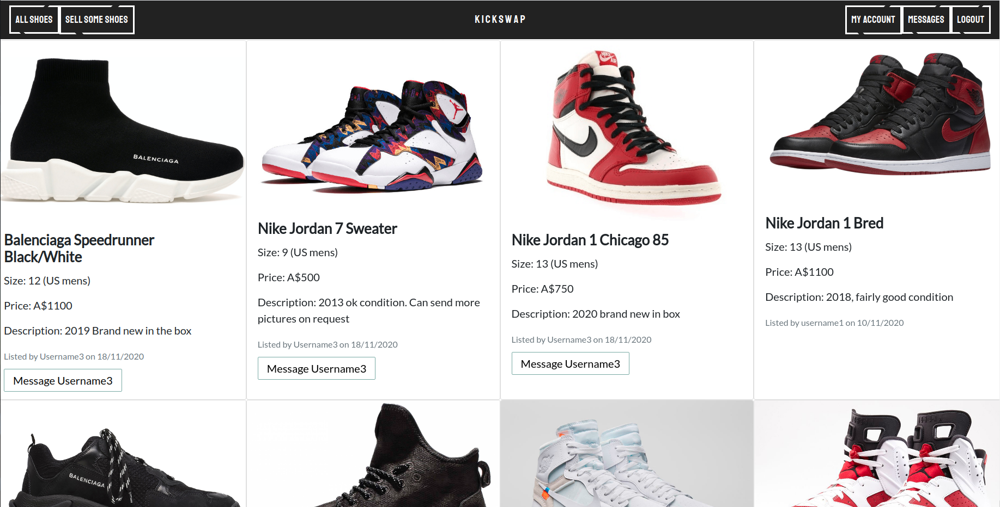
**New/Edit**
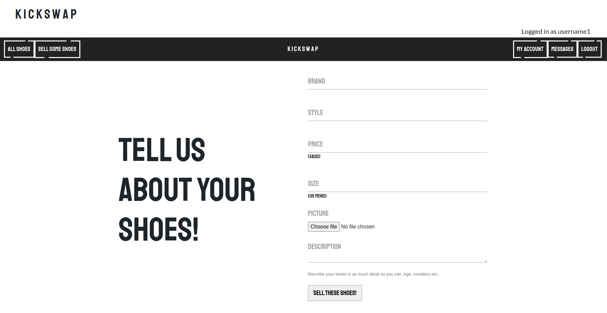
**Show**
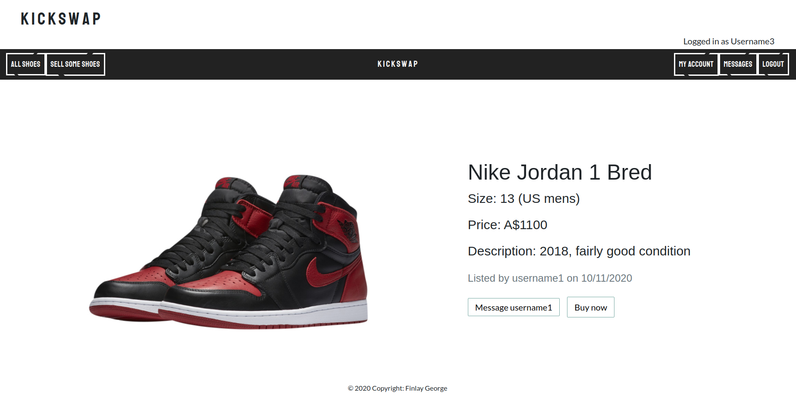
**Sign Up**
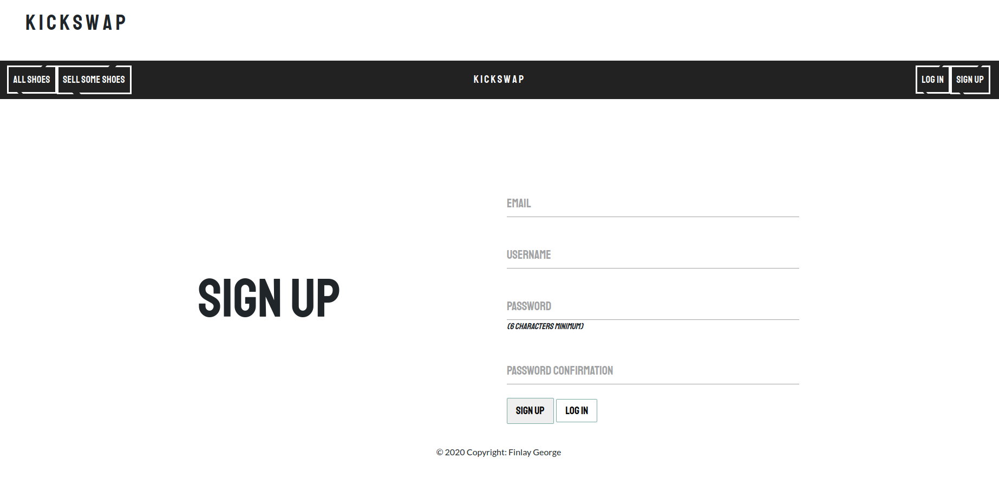
**Log In**
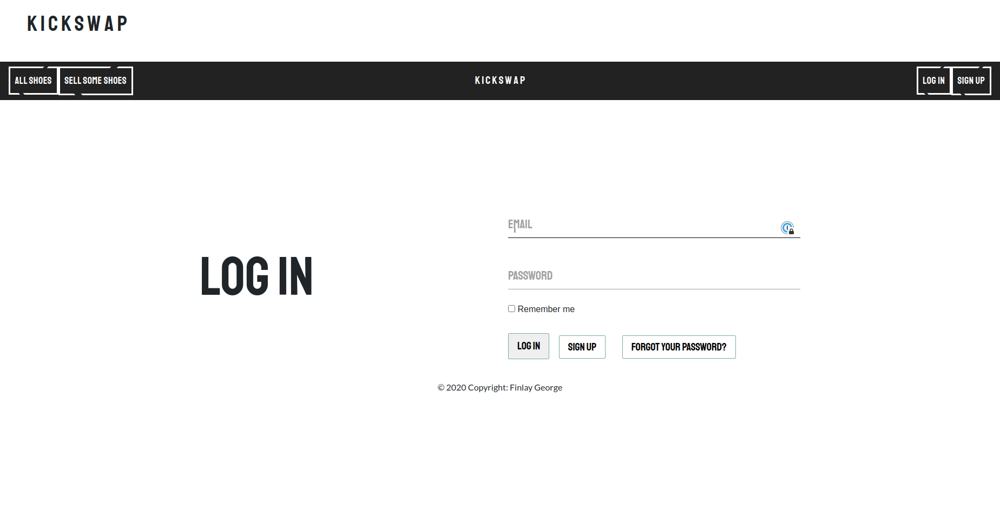
**Password Reset**
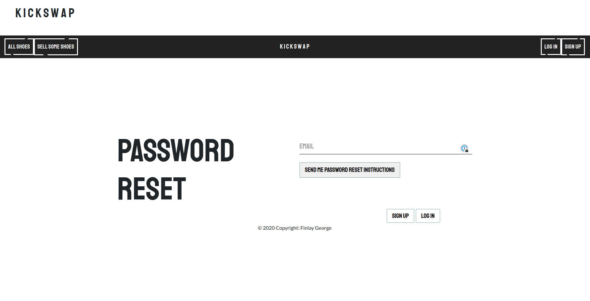
**Edit Account**
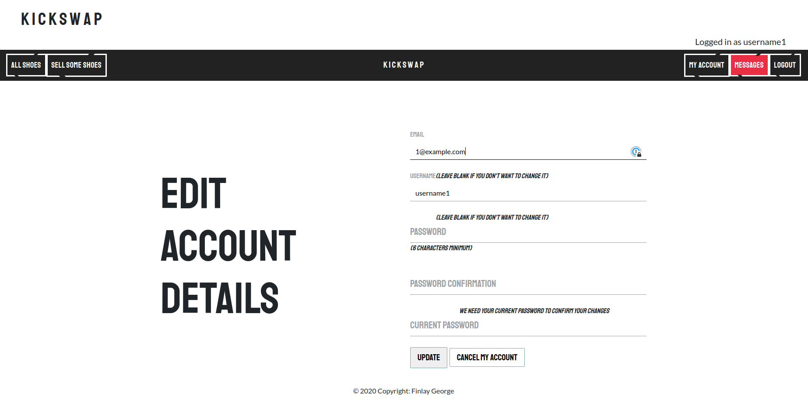
**Conversations**
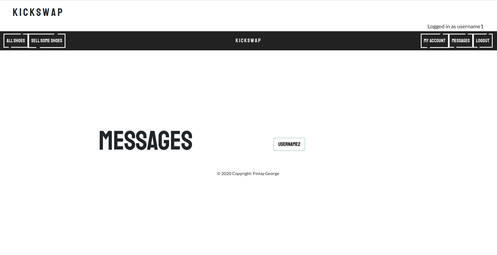
**Messages**
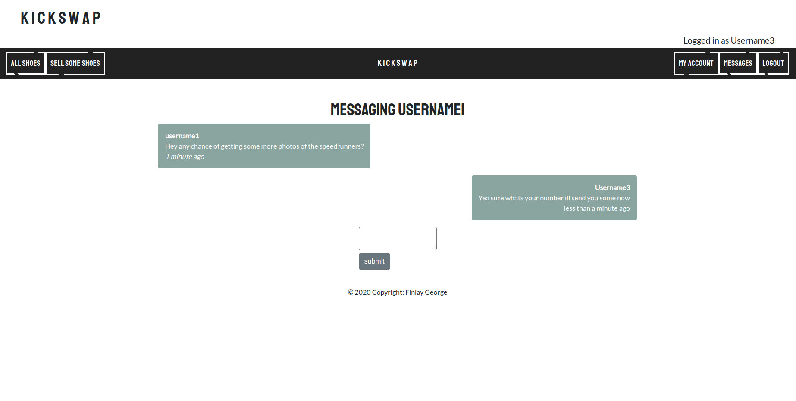
**Stripe Payment**
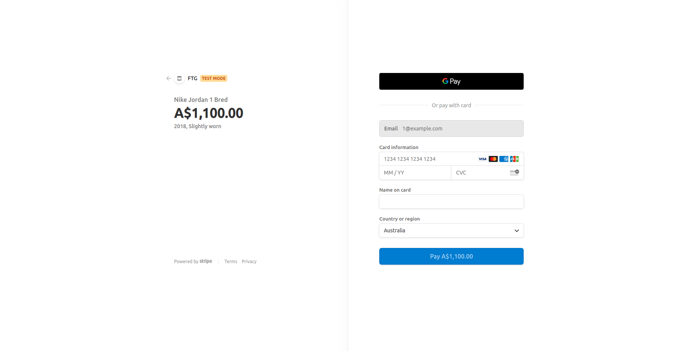
**Payment Success**
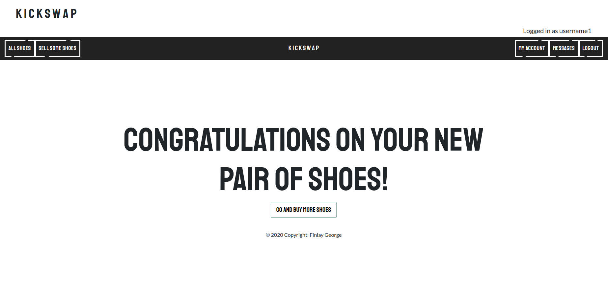
**404 Error**
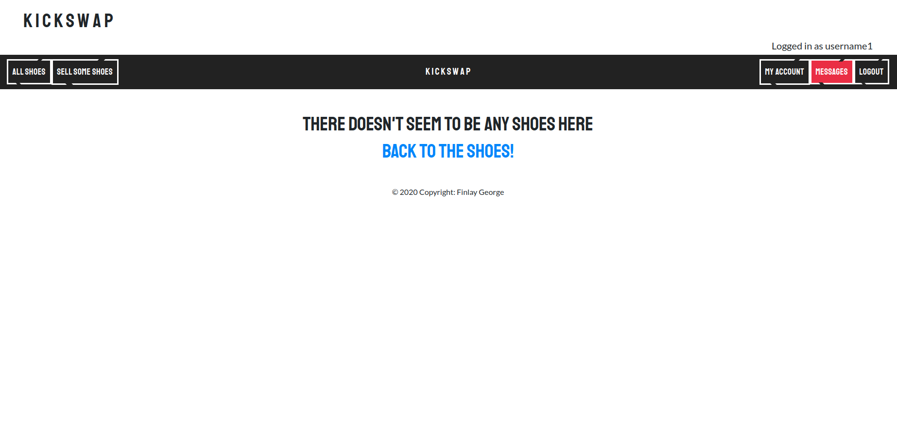
**500 Error**
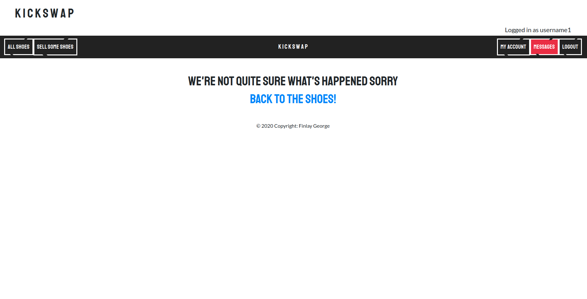

### Target Audience

The target audience for Kickswap is the sneaker community of Australia and anyone else that is looking to buy and/or sell shoes in Australia. This audience will be able to sell their shoes without our site taking a large cut of each sale. Making this a more friendly site to shoe sellers, and hopefully these sellers can pass savings on to the buyers.

### Tech stack

**Front-end:** HTML5, CSS3, SCSS, Embedded Ruby, Bootstrap 4, Javascript.

**Back-end:** Ruby 2.7.0, Ruby on Rails 6.0.3.

**Database:** Postgresql.

**Deployment:** Heroku.

**Additional:** Stripe, Devise, Ultrahook, AWS S3, AWS IAM.

**DevOps:** Git, Github, VS Code, Balsamiq Wireframes.

## R12 - User stories

- As a visitor with no account, I want to be able to sign up to become a user.
- As a visitor with no account, I want to be able to view all listings.
- As a user, I want to be able to log in to my account.
- As a user, I want to be able to log out out of my account.
- As a user, I want to be able to cancel my account.
- As a user, I want to be able to edit the details of my account I entered when it was created.
- As a user, I want to be able to search for shoes listed on the site.
- As a user, I want to be able to message other users about their listings.
- As a user, I want to be able to see I have a new message without checking my conversations.
- As a user, I do not want other users to see my account page.
- As a user, I do not want other users to see my account details.
- As a user, I do not want other users to be able to edit my listings.
- As a user, I do not want other users to be able to delete my listings.
- As a user, I want to be able to create new listings.
- As a user, I want to be able to edit listings I have created.
- As a user, I want to be able to delete listings I have created.
- As a user, I want to be able to view all listings I have created.
- As a user, I want to be able to purchase listings.
- As a user, I want to be able to sell my listing on the site.
- As a user, I want to be able to have my purchased shoes unlisted so other users don't think they're unsold.

## R13 - Wireframes

### Home

Originally I didn't about the difficulty of having multiple pictures per listings and had the listings less self contained. I also thought it would be possible to have message popups in the corner of the screen.


### New


### Show

Again my show had an additional picture in my wireframe and also doesn't have the message user button.


### Manage

Manage turned into the account page and is missing the edit function here.


### Messages

Messages is mostly unchanged, each users message is contained in it's own bubble now.


### Sign Up

Sign up is mostly the same but a username field was added.


### Log In

Log in is mostly the same but without the reset password and sign up links.


### Payment Success

Payment success is mostly the same but now without the images.


## R14 - ERD


## R15 - Explain the different high-level components (abstractions) in your app

## R16 - Detail any third party services that your app will use

DEVISE - FAKER - STRIPE - ULTRAHOOK - AWS S3 - RANSACK - PAGINATE

## R17 - Describe your projects models in terms of the relationships (active record associations) they have with each other

## R18 - Discuss the database relations to be implemented in your application

## R19 - Provide your database schema design

```ActiveRecord::Schema.define(version: 2020_11_12_061018) do
  create_table "active_storage_attachments", force: :cascade do |t|
    t.string "name", null: false
    t.string "record_type", null: false
    t.bigint "record_id", null: false
    t.bigint "blob_id", null: false
    t.datetime "created_at", null: false
    t.index ["blob_id"], name: "index_active_storage_attachments_on_blob_id"
    t.index ["record_type", "record_id", "name", "blob_id"], name: "index_active_storage_attachments_uniqueness", unique: true
  end

  create_table "active_storage_blobs", force: :cascade do |t|
    t.string "key", null: false
    t.string "filename", null: false
    t.string "content_type"
    t.text "metadata"
    t.bigint "byte_size", null: false
    t.string "checksum", null: false
    t.datetime "created_at", null: false
    t.index ["key"], name: "index_active_storage_blobs_on_key", unique: true
  end

  create_table "conversations", force: :cascade do |t|
    t.integer "sender_id"
    t.integer "recipient_id"
    t.datetime "created_at", precision: 6, null: false
    t.datetime "updated_at", precision: 6, null: false
  end

  create_table "listings", force: :cascade do |t|
    t.string "brand", null: false
    t.string "style", null: false
    t.integer "size", null: false
    t.text "description", null: false
    t.boolean "sold", default: false
    t.datetime "created_at", precision: 6, null: false
    t.datetime "updated_at", precision: 6, null: false
    t.bigint "user_id", null: false
    t.integer "price", null: false
    t.index ["user_id"], name: "index_listings_on_user_id"
  end

  create_table "messages", force: :cascade do |t|
    t.text "body"
    t.bigint "conversation_id"
    t.bigint "user_id"
    t.boolean "read", default: false
    t.datetime "created_at", precision: 6, null: false
    t.datetime "updated_at", precision: 6, null: false
    t.index ["conversation_id"], name: "index_messages_on_conversation_id"
    t.index ["user_id"], name: "index_messages_on_user_id"
  end

  create_table "users", force: :cascade do |t|
    t.string "email", default: "", null: false
    t.string "encrypted_password", default: "", null: false
    t.string "reset_password_token"
    t.datetime "reset_password_sent_at"
    t.datetime "remember_created_at"
    t.datetime "created_at", precision: 6, null: false
    t.datetime "updated_at", precision: 6, null: false
    t.string "username"
    t.index ["email"], name: "index_users_on_email", unique: true
    t.index ["reset_password_token"], name: "index_users_on_reset_password_token", unique: true
    t.index ["username"], name: "index_users_on_username", unique: true
  end

  add_foreign_key "active_storage_attachments", "active_storage_blobs", column: "blob_id"
  add_foreign_key "listings", "users"
end
```

## R20 - Trello

Initial Trello board on November 5th. Due dates were not used for this project due to the lack of chronological necessity in the build. Readme tasks are well defined but app tasks need to be further fleshed out as I approach aspects of the build. Styling tasks to be added as I see necessary.


Basic functionality of the app completed at this point. Starting to find more tasks that need doing and adding to the board.


More tasks have been added as previous tasks were completed. Constantly finding more small tasks that need taking care of at some point. Bugs list added at this point.


Backlog and bugs have filled up more but the project MVP is almost complete. Huge amount of styling also done at this point, but still a lot to go.

