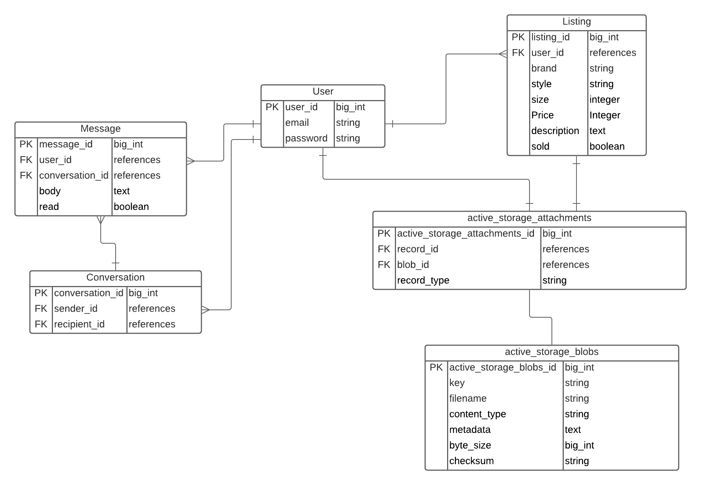
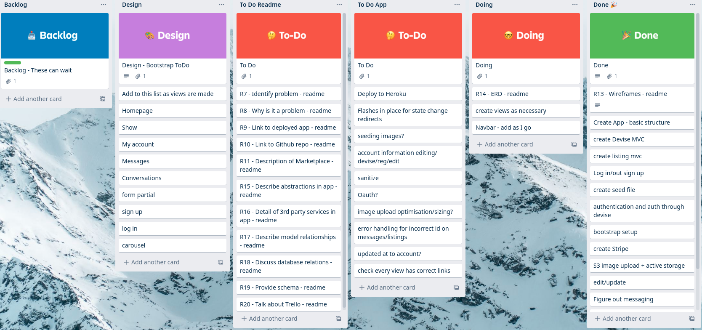
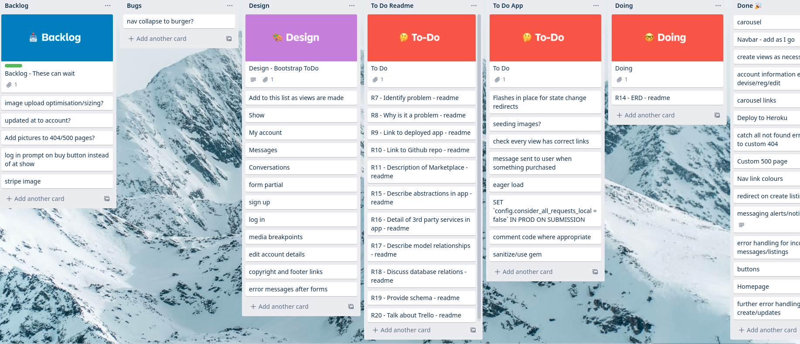
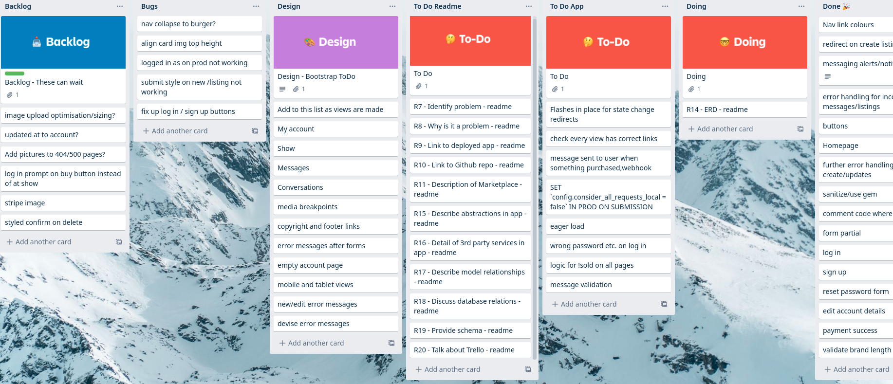

# README

## R7 - Identification of the problem you are trying to solve by building this particular marketplace app

A two way marketplace for sneakers does not currently exist in Australia that is widely used. There are a few international marketplaces like 'Goat' and 'StockX' that are widely used. These function heavily as a third party that takes a large cut of sales and manages the buying and selling themselves. The closest model that fits the scope of 'KICKSWAP' is 'Depop', which is not focused on shoes and again is an international company. 'KICKSWAP' aims to be the premier marketplace for buying and selling sneakers in a solely Australian focused market. 'KICKSWAP' will operate in a model similar to 'Gumtree', wherein users can be buyers or sellers. These buyers and sellers are then responsible for the management of their sales and purchases with 'KICKSWAP' merely being a platform. The removal of a sales cut also means sellers can save more and pass those savings on to the buyers.

## R8 - Why is it a problem that needs solving?

## R9 - A link (URL) to your deployed app

[kickswap.herokuapp.com](https://kickswap.herokuapp.com)

## R10 - A link to your GitHub repository

[github.com/Finbob12/sneaker-buy-sell](https://github.com/Finbob12/sneaker-buy-sell)

## R11 - Description of your marketplace app

### Purpose

### Functionality/Features

### Sitemap

### Screenshots

### Target Audience

### Tech Stack


## R12 - User stories

The app does not distinguish between buyers and sellers, all profiles are set with the ability to create or purchase listings however the user stories are broken down between buyers and sellers to show different app functions.

User management:

- As a site visitor, I want to be able to create an account in order to log in and become a buyer and seller.
- As a buyer or seller, I want to be able to enter my email and password to log in.
- As a buyer or seller, I want to be able to logout out of my account at any time.
- As a buyer or seller, I want to be able to delete my account if I no longer want to be a part of the site.
- As a buyer or seller, I want to be able to add details to my profile in order to show other users more about me.
- As a buyer or seller, I want to be able to delete my account in case I change my mind.

Listings:

- As a site visitor, I want to be able to see an overview of listings without logging in.
- As a seller, I want to be able to create listings in order to sell my shoes.
- As a seller, I want to be able to upload a name, bio, price and photo of my shoe in order to sell it.
- As a buyer, I want to be able to search for shoes, in order to find ones with the experience I am looking for.
- As a buyer or seller, I want to be able to like/favourite other listings in order to view them in my profile for later.
- As a seller, I want to be able to edit and delete my listings in order to reflect correct information.
- As a seller, I want to be able to favourite my own listing in order to increase it's popularity.
- As a seller, I want to be able to view my current listings in one place in order to keep track of what I am selling.
- As a seller, I want to be able to reply to buyers messages in order to answer questions about my listings.
- As a buyer, I want to be able to message sellers about listings in order to find out more information.
- As a buyer or seller, I want to be notified when I receive a new message so I don't have to keep checking my inbox.

Purchases:

- As a buyer, I want to be able to purchase shoes from other users listings.
- As a seller, I want to be able to sell my shoe through the site in order to receive money from the buyer.
- As a buyer, I want to be able to access my purchase receipts in order to keep track of my purchases.
- As a seller, I want my purchased shoes to be removed from view so others don't try to purchase it again.
- As a buyer, I want to be able to view a list of shoes that I have purchased in order to keep track of my purchases.

Authentication & Authorisation:

- As a buyer or seller, I do not want other users to be able to access my account in order to keep my data safe.
- As a seller, I do not want other users to be able to edit or delete my listings.
- As a buyer or seller, I do not want other users to see my favourites.
- As a seller, I do not want to see options to buy my listings.

## R13 - Wireframes

### Home


### New


### Show


### Manage


### Messages


### Sign Up


### Log In


### Payment Success


## R14 - ERD



## R15 - Explain the different high-level components (abstractions) in your app

## R16 - Detail any third party services that your app will use

DEVISE - FAKER - STRIPE - ULTRAHOOK - AWS S3

## R17 - Describe your projects models in terms of the relationships (active record associations) they have with each other

## R18 - Discuss the database relations to be implemented in your application

## R19 - Provide your database schema design

```ActiveRecord::Schema.define(version: 2020_11_12_061018) do
  create_table "active_storage_attachments", force: :cascade do |t|
    t.string "name", null: false
    t.string "record_type", null: false
    t.bigint "record_id", null: false
    t.bigint "blob_id", null: false
    t.datetime "created_at", null: false
    t.index ["blob_id"], name: "index_active_storage_attachments_on_blob_id"
    t.index ["record_type", "record_id", "name", "blob_id"], name: "index_active_storage_attachments_uniqueness", unique: true
  end

  create_table "active_storage_blobs", force: :cascade do |t|
    t.string "key", null: false
    t.string "filename", null: false
    t.string "content_type"
    t.text "metadata"
    t.bigint "byte_size", null: false
    t.string "checksum", null: false
    t.datetime "created_at", null: false
    t.index ["key"], name: "index_active_storage_blobs_on_key", unique: true
  end

  create_table "conversations", force: :cascade do |t|
    t.integer "sender_id"
    t.integer "recipient_id"
    t.datetime "created_at", precision: 6, null: false
    t.datetime "updated_at", precision: 6, null: false
  end

  create_table "listings", force: :cascade do |t|
    t.string "brand", null: false
    t.string "style", null: false
    t.integer "size", null: false
    t.text "description", null: false
    t.boolean "sold", default: false
    t.datetime "created_at", precision: 6, null: false
    t.datetime "updated_at", precision: 6, null: false
    t.bigint "user_id", null: false
    t.integer "price", null: false
    t.index ["user_id"], name: "index_listings_on_user_id"
  end

  create_table "messages", force: :cascade do |t|
    t.text "body"
    t.bigint "conversation_id"
    t.bigint "user_id"
    t.boolean "read", default: false
    t.datetime "created_at", precision: 6, null: false
    t.datetime "updated_at", precision: 6, null: false
    t.index ["conversation_id"], name: "index_messages_on_conversation_id"
    t.index ["user_id"], name: "index_messages_on_user_id"
  end

  create_table "users", force: :cascade do |t|
    t.string "email", default: "", null: false
    t.string "encrypted_password", default: "", null: false
    t.string "reset_password_token"
    t.datetime "reset_password_sent_at"
    t.datetime "remember_created_at"
    t.datetime "created_at", precision: 6, null: false
    t.datetime "updated_at", precision: 6, null: false
    t.string "username"
    t.index ["email"], name: "index_users_on_email", unique: true
    t.index ["reset_password_token"], name: "index_users_on_reset_password_token", unique: true
    t.index ["username"], name: "index_users_on_username", unique: true
  end

  add_foreign_key "active_storage_attachments", "active_storage_blobs", column: "blob_id"
  add_foreign_key "listings", "users"
end
```

## R20 - Trello

Initial Trello board on November 5th. Due dates were not used for this project due to the lack of chronological necessity in the build. Readme tasks are well defined but app tasks need to be further fleshed out as I approach aspects of the build. Styling tasks to be added as I see necessary.


Basic functionality of the app completed at this point. Starting to find more tasks that need doing and adding to the board.



More tasks have been added as previous tasks were completed. Constantly finding more small tasks that need taking care of at some point. Bugs list added at this point.



Backlog and bugs have filled up more but the project MVP is almost complete. Huge amount of styling also done at this point, but still a lot to go.

